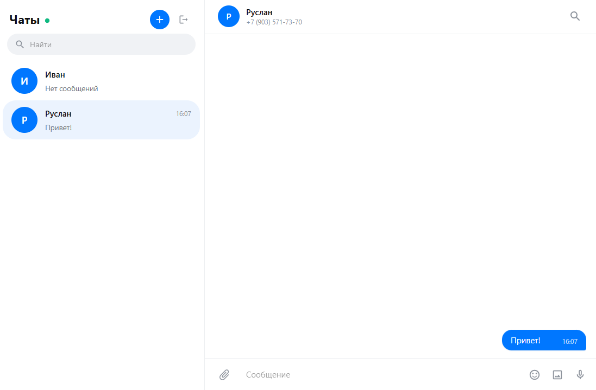

# Тестовое задание на должность фронтенд разработчик React

Страница представляет собой упрощенную веб-версию мессенджера MAX, которая работает через GREEN API

## Технологии

- Typescript, React, Material UI, Tanstack React Query

### Функциональность

- Авторизация пользователя через учетные данные GREEN API
- Добавление чата с новым собеседником
- Отправка сообщений
- Получение сообщений

#### Для запуска проекта необходимы

- Node.js 18.x или выше;
- Менеджер пакетов npm или pnpm;
- Авторизованный аккаунт в GREEN API;

#### Запустить проект локально можно

с помощью команды `npm i & npm run dev` или `pnpm i & pnpm run dev` 

#### Проект можно посмотреть по ссылке

https://51.250.115.119/test-green-api/